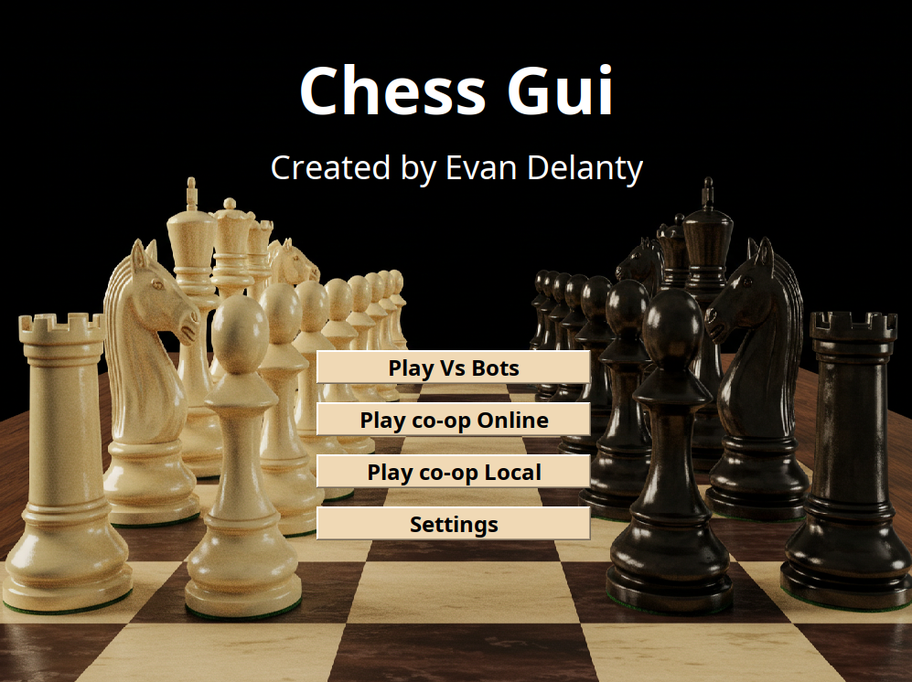
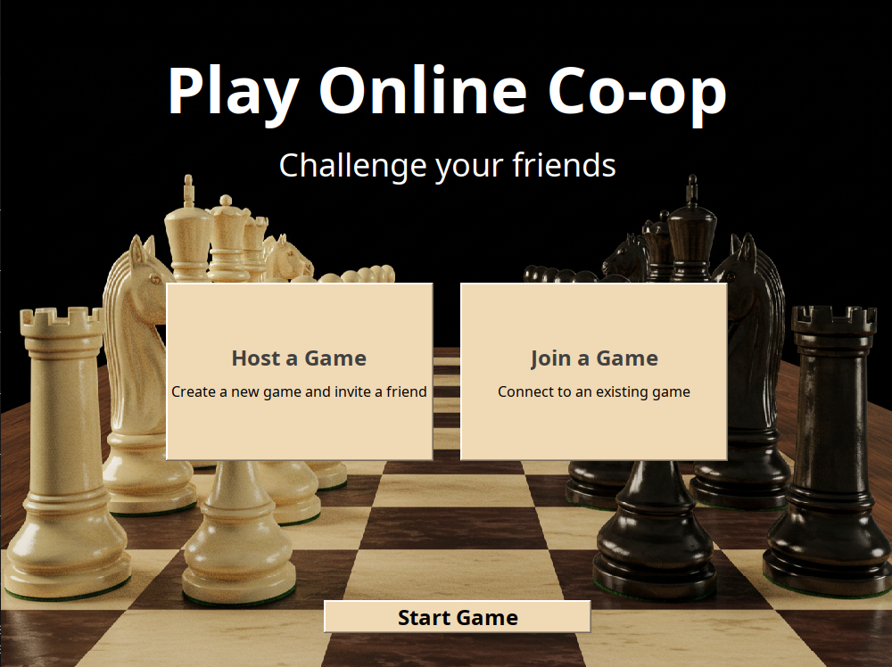
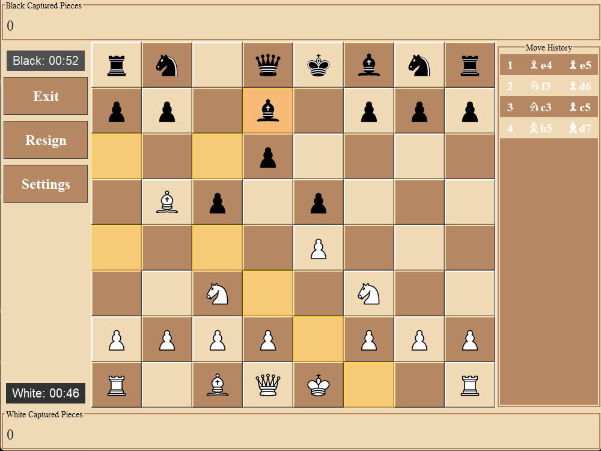
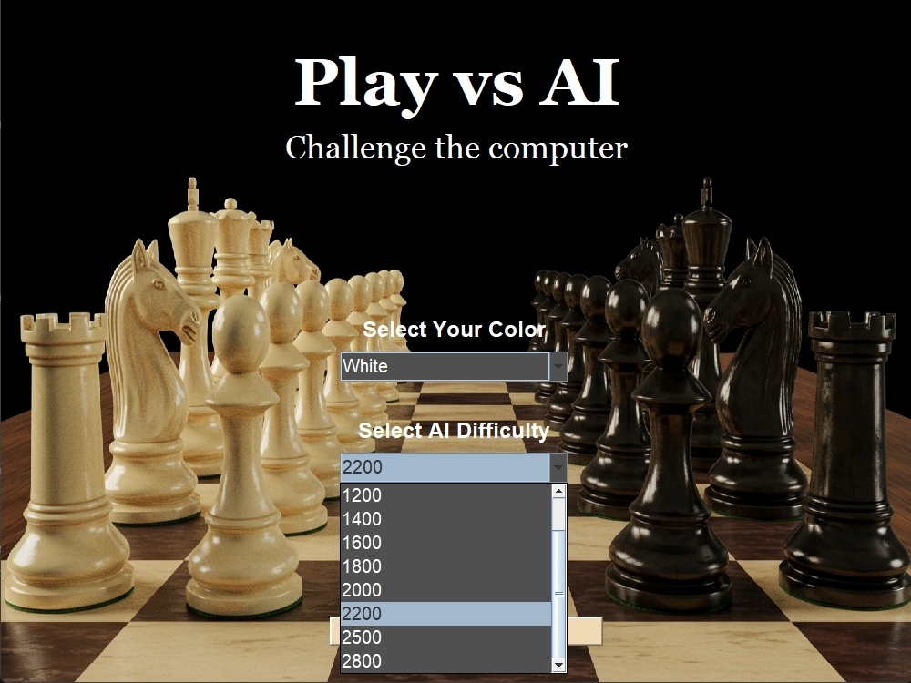
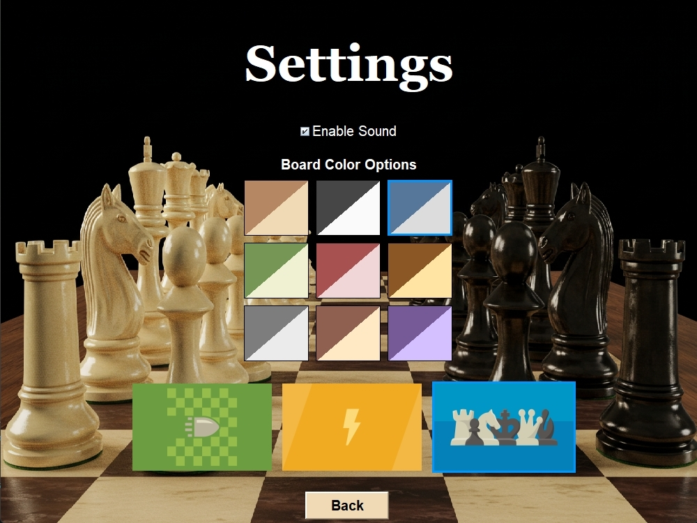
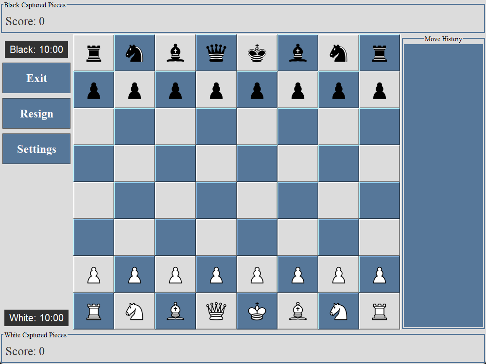
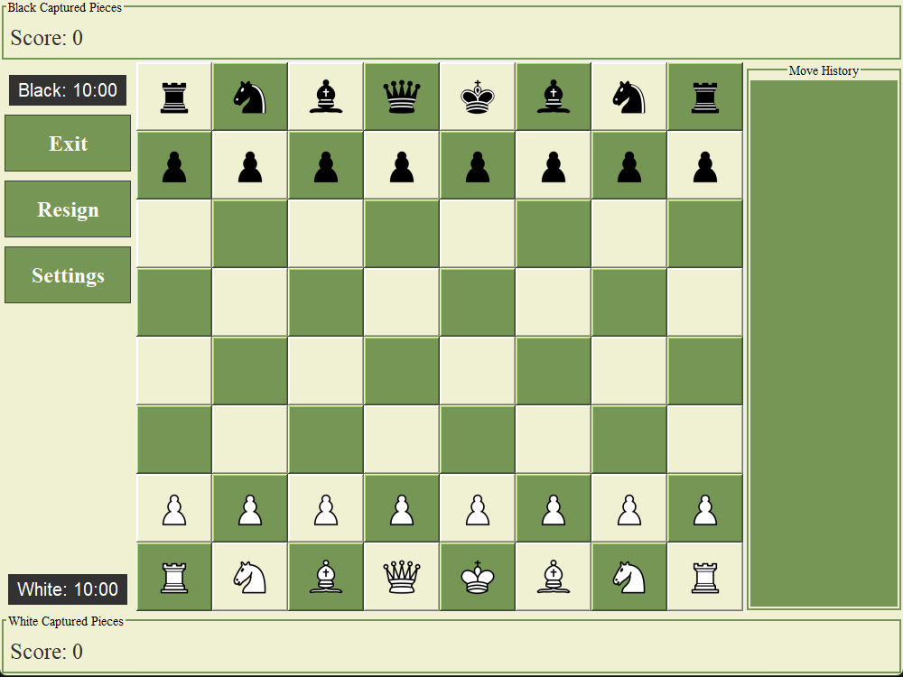
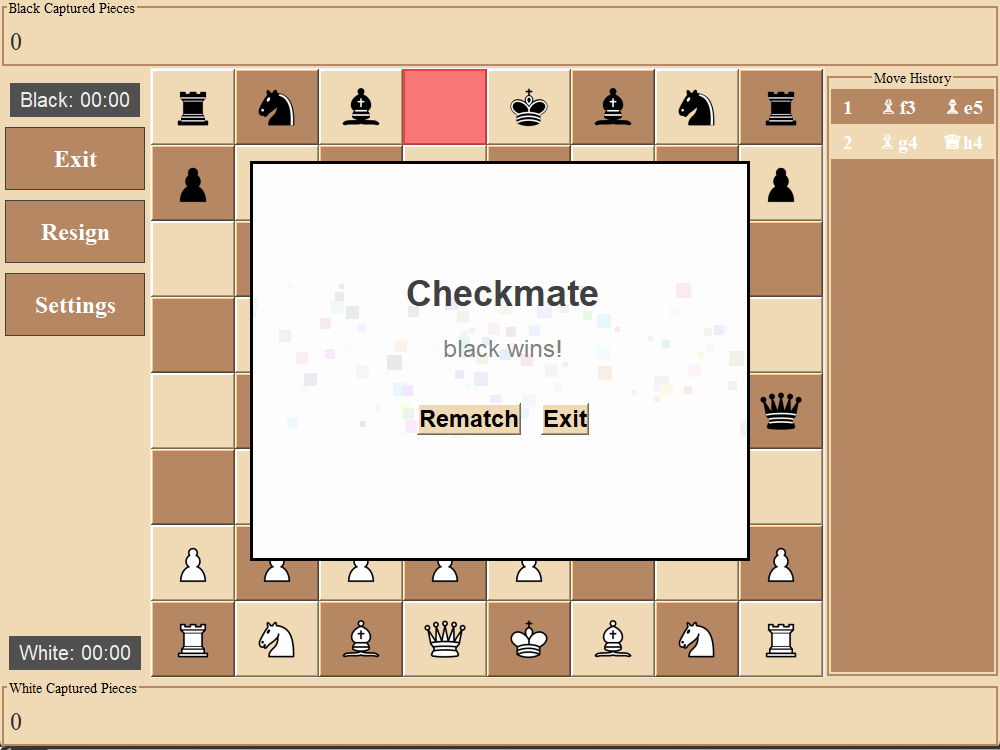

# Chess Gui - Java Chess Game

This program is a Java-based chess gui with a peer-to-peer connection online mode, bot support through the Stockfish engine, move highlighting for beginners, and various settings customization options including sound!f

Support for Windows, MacOS, and Linux machines!

## Features
- **Move Highlighting**: Visual feedback for possible moves.
- **Play vs AI**: Challenge an AI opponent with adjustable difficulty.
- **Custom Settings**: Configure the game to your preferences.
- **Checkmate Animation**: Fun confetti for game-ending moves.
- **P2P Mode**: Play against a friend over a network or on the couch locally.

## Screenshots

## Startup Screen


## Peer-to-peer Online Mode


### Move Highlighting


### Play vs AI Screen


### Settings Screen


### Blue Theme


### Green Theme


### Winning Animation


## Installation
1. Install Java 21:
   ```sh
   https://www.oracle.com/java/technologies/downloads/#java21
   or
   https://openjdk.org/projects/jdk/21/
   ```
2. Install the Stockfish Engine:
   ```sh
   sudo apt-get install stockfish
   ```
3. Clone the repository:
   ```sh
   git clone https://github.com/yourusername/P2PChess.git
   ```
4. Navigate to the project directory:
   ```sh
   cd P2PChess
   ```
5. Compile and run the game:
   ```sh
   make run
   ```

## How to Play
- Click on a piece to select it. Right click to show legal moves.
- Click again on a destination tile to move.
- Play until checkmate, stalemate, or until your time runs out!

## Maintainers
- Evan Delanty